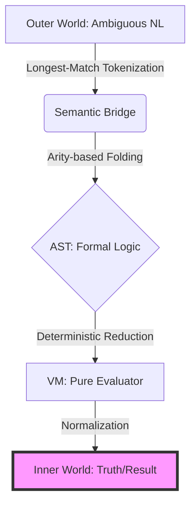
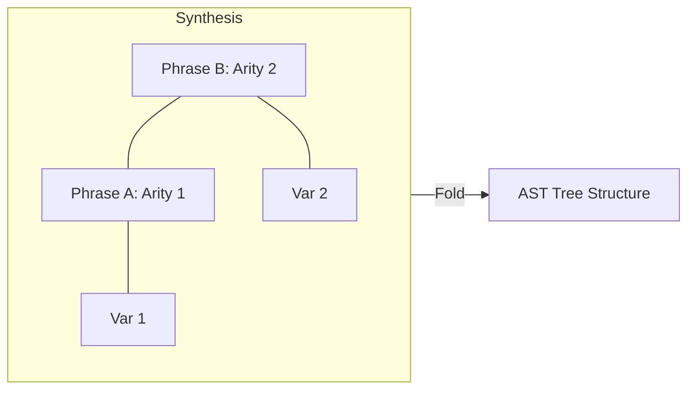
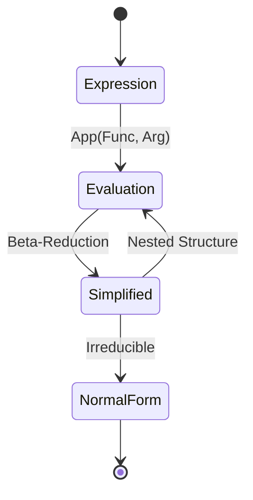
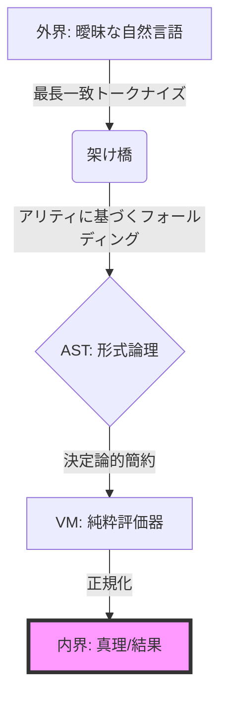
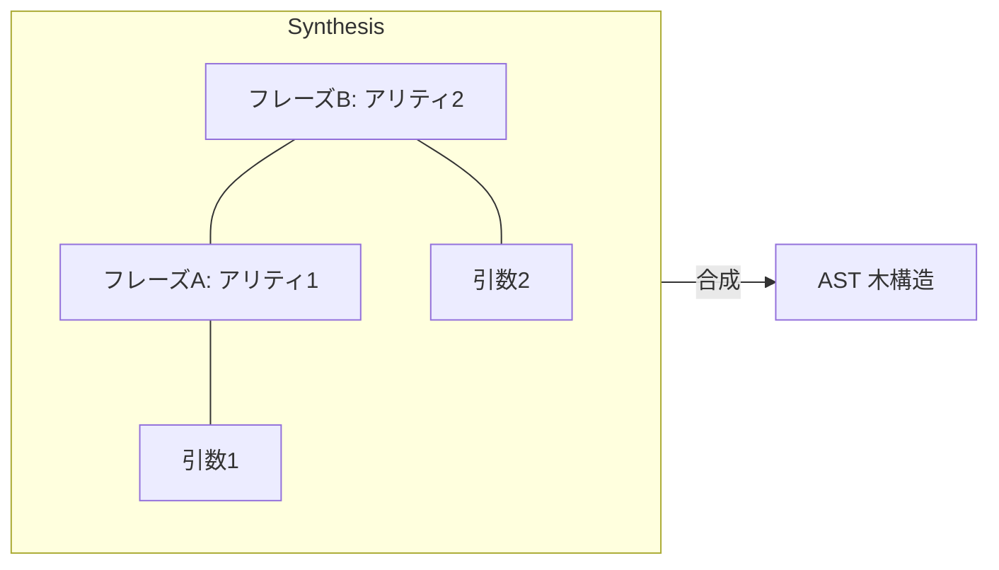
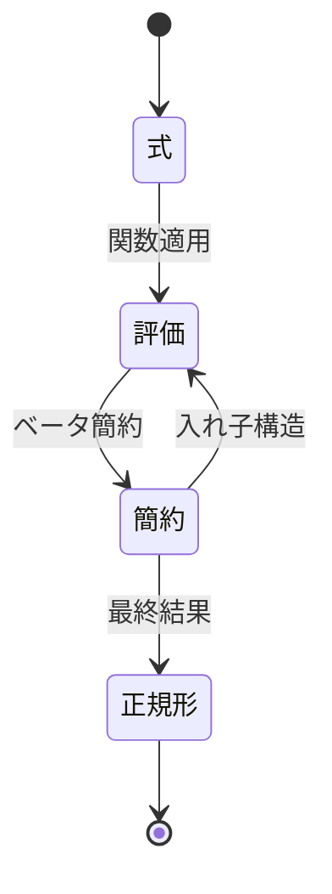

# Methodology Diagrams: Morphic Inner World (Mermaid Source)

This document contains the original Mermaid source code for the diagrams used in the academic papers. These diagrams visualize the transition from Natural Language to Deterministic Logic.

## 1. English Diagrams (EN)

### 1.1 The Global Flow

### 1.2 Arity-based Folding

### 1.3 Normal Form Reduction

---

## 2. Japanese Diagrams (JP)

### 2.1 全体フロー

### 2.2 アリティに基づく論理合成

### 2.3 正規形への簡約

