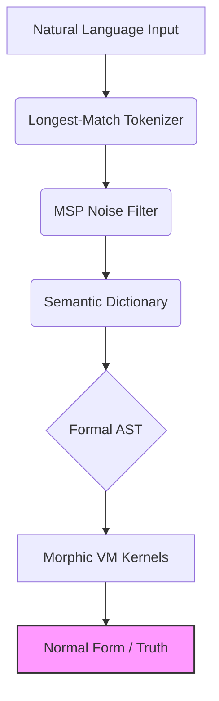
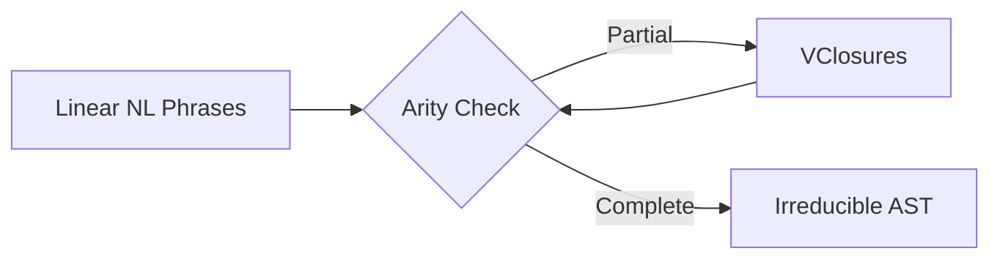
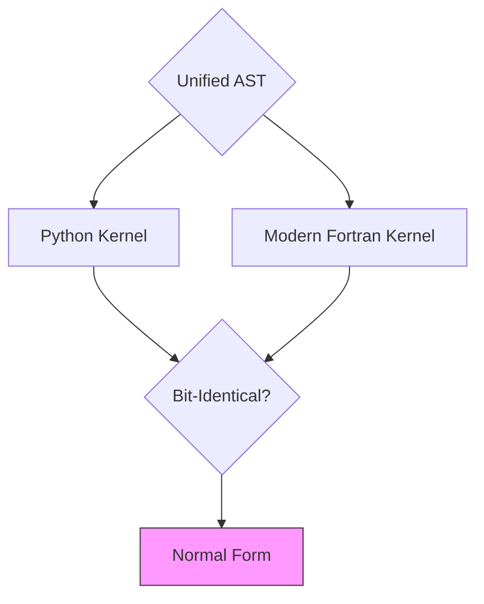
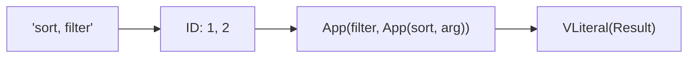
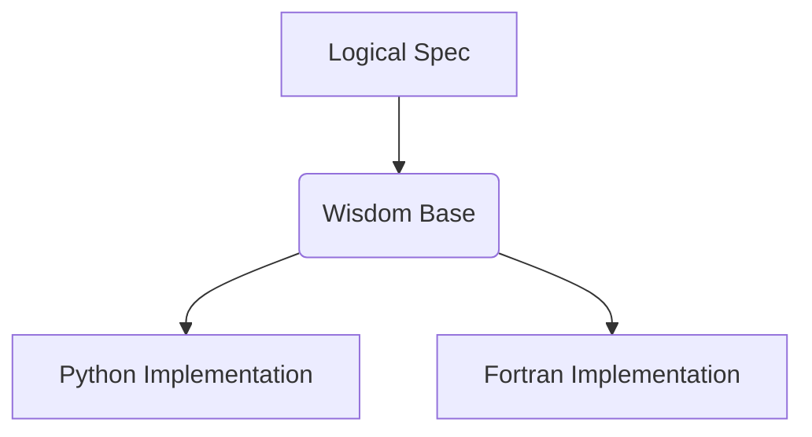
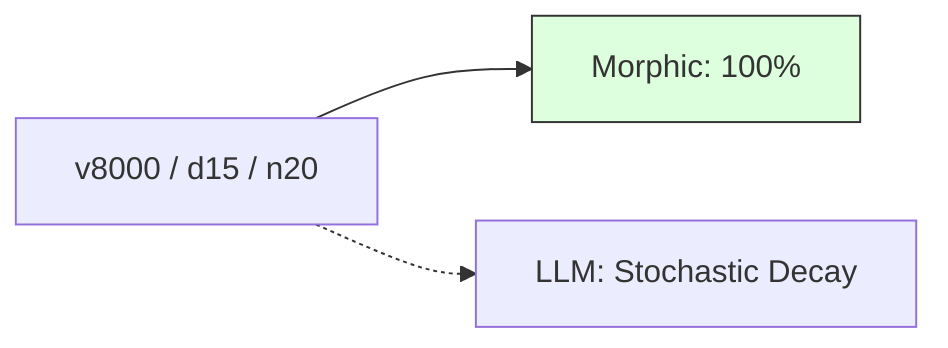
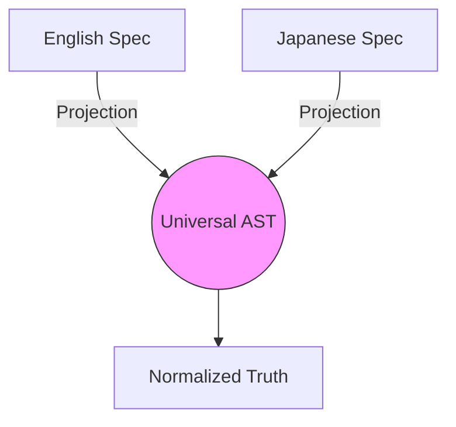
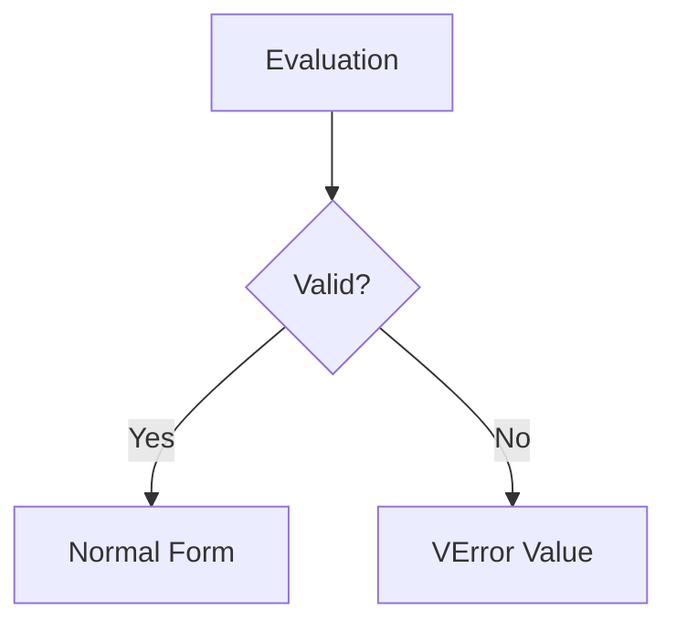

# Methodology Diagrams: Morphic Inner World (Mermaid Source)

This document contains the FINAL, verified Mermaid source code for the academic paper. Each figure is strictly ONE single-panel diagram.

## 1. English Diagrams (EN)

### 1.1 Global Architecture

### 1.2 Recursive Folding Logic

### 1.3 Deterministic Kernel Parity

### 1.4 Execution Trace Pipeline

### 1.5 Substrate Independence Layer

### 1.6 Scaling Reliability

### 1.7 Language Invariance Manifold

### 1.8 Deterministic Error Flow

